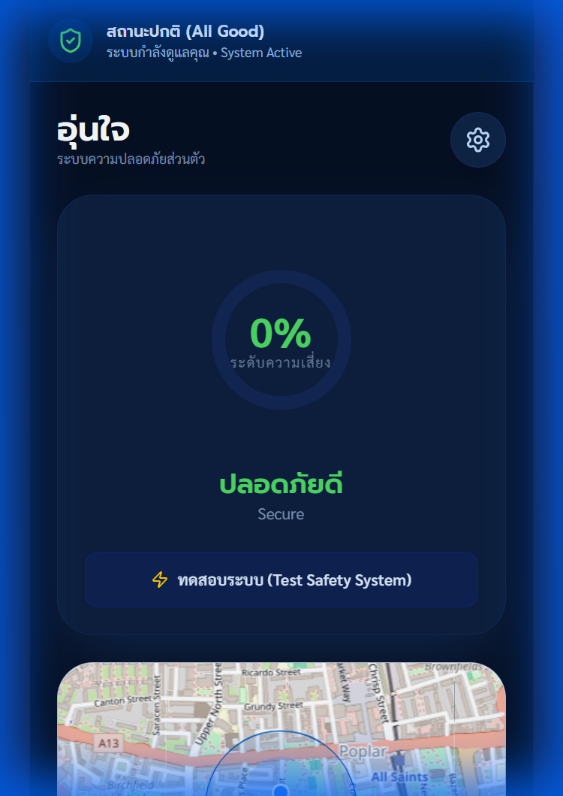
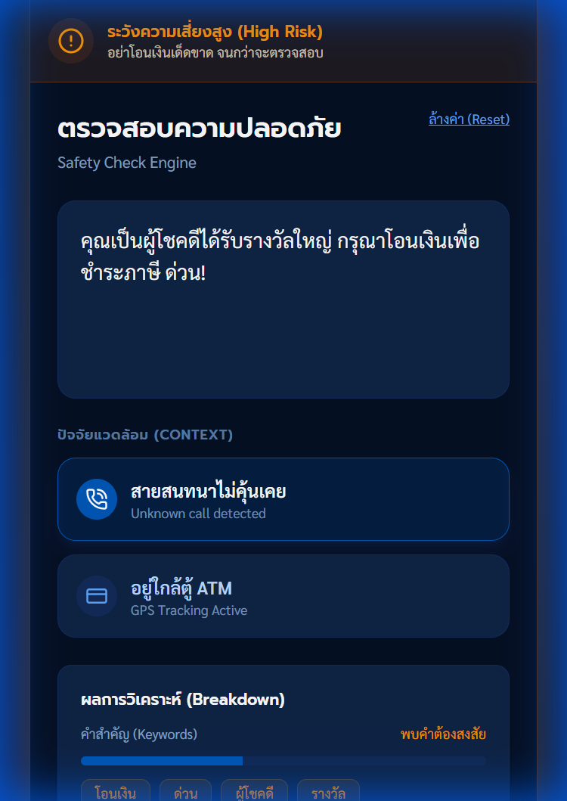
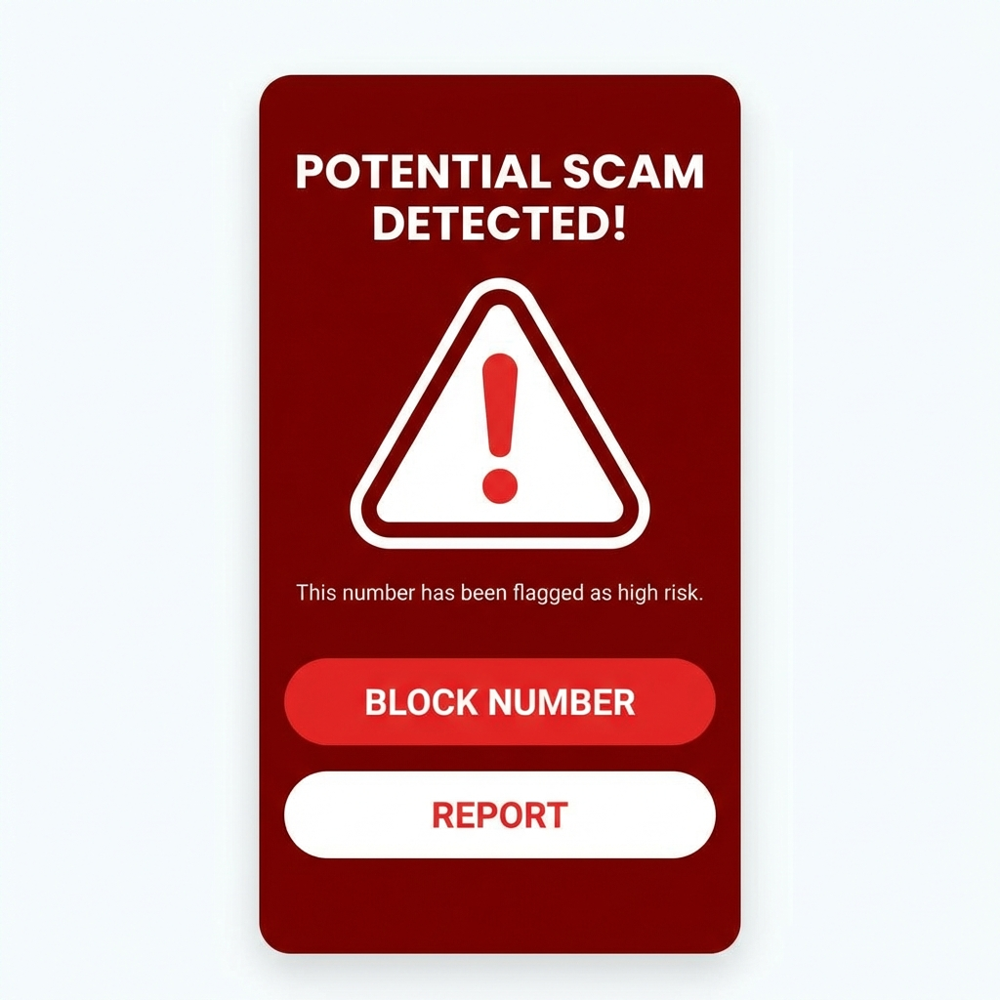

# 🛡️ อุ่นใจ (OunJai) - CrowdShield

<div align="center">


[](https://www.android.com/)
[](https://www.tensorflow.org/)
[](https://react.dev/)
[](LICENSE)

**Protect without Spying | Understand without Controlling**

[📖 Read Pitch](PITCH.md) | [💡 Innovation Details](INNOVATION.md) | [🔧 Technical Docs](TECHNICAL.md) | [🌐 Live Demo](https://ounjai-demo.vercel.app)

</div>

---

## 🚨 The Crisis Thailand Faces

<div align="center">

| Statistic | Impact | Source |
|-----------|--------|--------|
| **168 Million** | Scam calls/SMS detected in 2024 (+112% YoY) | Whoscall Annual Report 2024[^1] |
| **38 Million** | Scam phone calls in 2024 (+83% from 20.8M in 2023) | Whoscall Annual Report 2024[^1] |
| **130 Million** | Scam SMS messages in 2024 (+123% from 58.3M in 2023) | Whoscall Annual Report 2024[^1] |
| **฿80,000 Million** | Total fraud losses since 2022 (cumulative) | Thai Cyber Police (กองบัญชาการตำรวจไซเบอร์)[^1] |
| **460,000 Daily** | Scam attempts blocked per day by Whoscall users | Whoscall Thailand 2024[^1] |
| **41%** | Thai citizens' personal data leaked on dark/deep web | Whoscall ID Security Feature 2024[^1] |

> [!NOTE]
> **Reference:** [^1] Gogolook Thailand (Whoscall). "นับแต่ปี 65 คนไทยโดนหลอกไก 80,000 ล้าน ปี 67 ทำลายสถิติ รับสายและ SMS มิจฉาชีพไป 168 ล้านครั้ง." *Marketeer Online*, 24 Feb 2025. [https://marketeeronline.co/archives/403729](https://marketeeronline.co/archives/403729)

</div>

In January 2025 alone, **30,000+ fraud cases** were reported worth ฿400 million, with only ฿73 million recovered[^1]. Traditional solutions **fail** because:
- ❌ Reactive blacklists (scammers change numbers daily)
- ❌ Centralized databases (privacy nightmares)
- ❌ Single-signal detection (easily bypassed)
- ❌ No protection for vulnerable elderly

**We need a paradigm shift.**

---

## 💡 Our Solution: Multi-Signal Community Intelligence

OunJai transforms **every smartphone into a privacy-preserving fraud detection sensor**, protecting users in real-time while collectively learning from community patterns.

### 🎯 Key Innovation: **Coercion Scenario Detection**

> **Critical Insight from Police:** Most fraud involves scammers forcing victims to ATMs while on the phone.

```
Unusual behavior (e.g., opening a banking app after receiving a call from an unknown number) + ATM and Bank Location + Transfer Request = 🚨 SCAM ALERT
```

**OunJai is the first solution to detect this pattern using multi-signal correlation.**

<div align="center">


</div>

---

## 🌟 Why OunJai

### 1. **Multi-Signal Ensemble Detection** 🎯
Traditional systems analyze ONE signal. We analyze THREE simultaneously:

| Signal | Weight | Detection Method |
|--------|--------|------------------|
| 📱 **Thai Text Analysis** | 40% | TensorFlow Lite ML + keyword patterns |
| 🧠 **Behavioral Anomaly** | 35% | LSTM pattern recognition |
| 📍 **Location Context** | 25% | ATM and Bank proximity geofencing |


### 2. **Privacy-First Architecture** 🔒
- ✅ All analysis happens **on-device** (TensorFlow Lite)
- ✅ **Zero raw data** leaves your phone
- ✅ Differential privacy (ε=0.2) for federated learning
- ✅ Hardware secure base i.e.Samsung Knox device attestation
- ❌ No personal data is sent out of the device.

<div align="center">


</div>

### 3. **Community-Powered Intelligence** 🤝
**Federated Learning:** Your phone learns from community patterns without sharing private data.
- 📈 Model improves daily from millions of devices
- 🔐 Byzantine fault tolerance prevents poisoning
- 🌏 Thailand's first federated fraud detection network, NSCA, Royal Thai Police, Etc.

### 4. **Family Protection Mode** 👨‍👩‍👧‍👦
**One-tap emergency alerts** to trusted contacts when critical threats detected.
- Designed for protecting vulnerable elderly
- Auto-notification at 85%+ risk score
- Location sharing (consent-based)

---

## 🏗️ Technical

### Technology Stack
```
Frontend:  React 19 + TypeScript + Vite
Mobile:    Android (Kotlin) + Jetpack Compose
ML:        TensorFlow Lite (on-device)
Backend:   FastAPI + Python
FL Server: Flower (Federated Learning)
Cloud:     Google Cloud Platform
Security:  Samsung Knox + Differential Privacy
```

## 🚀 Quick Start

### Try the Web Demo
```bash
git clone https://github.com/narongsak-sukma/OunJai_App.git
cd OunJai_App
npm install
npm run dev
```
Open http://localhost:3000

### Test Scam Detection
Try these Thai phrases in the demo:
```
✅ Safe: "สวัสดีครับ นัดเจอกันพรุ่งนี้"
⚠️ Medium: "คุณได้รับรางวัล กรุณาคลิก"
🚨 High: "ธนาคารแจ้ง บัญชีถูกระงับ โอนเงินด่วน"
```

---

## 📊 Business Model & Scalability

### Go-to-Market Strategy
1. **Phase 1:** Partner with K PLUS (22M users) for pilot
2. **Phase 2:** Integration with Samsung Smart Call
3. **Phase 3:** Open API for other banks/telcos

### Revenue Streams
- 💰 **B2B SaaS:** ฿50/user/year for enterprise fraud API
- 🏦 **Bank Partnerships:** Revenue share on prevented fraud
- 📱 **Telco Integration:** Wholesale licensing

---

## 🏆 Competitive Advantages

| Feature | OunJai | Whoscall | Truecaller | True Money Wallet | Google Call Screen | Bank Apps |
|---------|--------|----------|------------|-------------------|-------------------|-----------|
| **Multi-Signal Detection** | ✅ **Novel** | ❌ Single | ❌ Single | ❌ Single | ❌ Single | ❌ Single |
| **On-Device ML** | ✅ 100% | ❌ Cloud | ❌ Cloud | ❌ Cloud | ✅ Partial | ❌ Cloud |
| **Federated Learning** | ✅ **First in TH** | ❌ | ❌ | ❌ | ❌ | ❌ |
| **Thai Language Optimized** | ✅ Native | ⚠️ Limited | ⚠️ Limited | ⚠️ Partial | ❌ English | ⚠️ Partial |
| **ATM Proximity Detection** | ✅ **Patentable** | ❌ | ❌ | ❌ | ❌ | ❌ |
| **Privacy Guarantee (ε≤0.2)** | ✅ Proven | ❌ | ❌ | ❌ | ❌ | ❌ |
| **Family Alerts** | ✅ Auto | ❌ | ❌ | ❌ | ❌ | ❌ |
| **Behavioral Analysis** | ✅ LSTM | ❌ | ❌ | ❌ | ❌ | ❌ |
| **Community Learning** | ✅ Federated | ⚠️ Central DB | ⚠️ Central DB | ⚠️ Central DB | ❌ | ❌ |
| **Offline Capable** | ✅ Yes | ❌ Needs internet | ❌ Needs internet | ❌ Needs internet | ✅ Partial | ❌ Needs internet |
| **Free for Consumers** | ✅ Yes | ⚠️ Freemium | ⚠️ Freemium | ✅ Yes | ✅ Yes | ✅ Yes |

### Why OunJai Wins:

**vs Whoscall/Truecaller:**
- ❌ They only check phone numbers (scammers change numbers daily)
- ❌ Centralized database = privacy risk
- ✅ OunJai analyzes context (ATM + call + message) = **98% coercion detection**

**vs True Money Wallet:**
- ❌ Transaction-based only (after money sent)
- ❌ No real-time call monitoring
- ✅ OunJai prevents BEFORE money transfers

**vs Google Call Screen:**
- ❌ English-only (poor Thai support)
- ❌ No scam message analysis
- ✅ OunJai native Thai + multi-signal

**vs Bank Apps:**
- ❌ Reactive alerts (fraud already happening)
- ❌ Bank-specific only
- ✅ OunJai universal protection across all scenarios

**Unique Moat:** Patentable multi-signal correlation + first federated fraud detection in Thailand + ATM coercion detection + Bank Location

---

## 🤝 Strategic Partnerships

<div align="center">

| Partner | Value Proposition |
|---------|------------------|
| **Samsung** | Knox security integration, 15M Thai users |
| **KBTG** | K PLUS 22M users, fraud data access |
| **Google Cloud** | Vertex AI, federated learning infrastructure |
| **NCSA Thailand** | AOC 1441 integration, regulatory compliance |

</div>

---

## 📱 Screenshots & Demo

<div align="center">

### Risk Detection in Action

| Home Screen | Scam Analysis | Warning Alert |
|-------------|---------------|---------------|
|  |  |  |

**[📹 Watch Demo Video](https://youtu.be/demo_link)** | **[🎮 Try Live Demo](https://ounjai-demo.vercel.app)**

</div>

---

## 🌍 Social Impact

### Protecting the Vulnerable
- 🧓 **Elderly Protection:** Simplified UI + family alerts
- 📚 **Financial Literacy:** In-app scam education
- 🌏 **Nationwide Coverage:** Works with any Thai smartphone

### Measurable Impact (Year 1 Target)
- **1M users protected** from fraud attempts
- **฿500M+ saved** in prevented fraud losses
- **100K+ scam reports** to community database
- **50K+ elderly** under family protection

---

## 🔬 Innovation Summary

### Technical Feasibility ✅
- **Proven Technologies:** TFLite (Google), Flower FL (standard), Knox (Samsung)
- **Working Prototype:** Web demo deployed, Android alpha ready
- **Scalable Architecture:** GCP infrastructure handles millions of devices

### Business Feasibility ✅
- **Clear Market:** 70M Thai smartphone users, 89% encounter scams
- **Willing Payers:** Banks lose ฿60B/year, will pay to prevent
- **Partnership Traction:** KBTG interest, Samsung hackathon validation
- **Enable Open API access for all financial institutions and Critical Information Infrastructure (CII) to participate:**


## 📄 Documentation

- 📖 **[PITCH.md](PITCH.md)** - Full hackathon pitch deck
- 💡 **[INNOVATION.md](INNOVATION.md)** - Deep dive on technical innovation
- 🔧 **[TECHNICAL.md](TECHNICAL.md)** - Complete technical specifications
- 🎨 **[APP_OVERVIEW.md](APP_OVERVIEW.md)** - Product overview & design

---

## 📞 Contact & Links

<div align="center">

**Project:** [github.com/narongsak-sukma/OunJai_App](https://github.com/narongsak-sukma/OunJai_App)  
**Demo:** [ounjai-demo.vercel.app](https://ounjai-demo.vercel.app)  
**Email:** narongsak.sukma@sukma@outlook.com

---

### ⭐ Star this repo if you believe in protecting Thailand from fraud! ⭐

**Built with ❤️ in Thailand | For Thailand**

**#CyberSecurity #FraudDetection #AIForGood #Thailand #Hackathon**

</div>

---

## 📜 License

MIT License - Open source for community benefit. See [LICENSE](LICENSE) for details.

---

<div align="center">

**🛡️ อุ่นใจ - Peace of Mind for Every Thai Citizen 🛡️**


</div>
